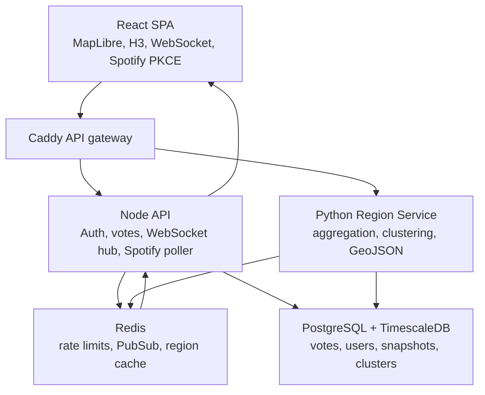

# Architecture

SoundscapeMap follows the prompt's microservices-lite layout.

## Runtime Responsibilities

- Auth service: Spotify PKCE exchange, JWT issuance, encrypted refresh-token persistence.
- Vote service: validates H3 cells, genres, track ids, rate limits, stores votes, broadcasts updates.
- Region service: computes decayed genre scores, fixed H3 GeoJSON fallback, cluster GeoJSON snapshots.
- ML pipeline: builds feature vectors and evaluates HDBSCAN, GMM, and QDA quality with fallback logic.
- WebSocket hub: subscribes clients to visible cells and fans out region updates from Redis.
- Spotify poller: polls current playback every 30 seconds per connected user with a circuit breaker.
- React app: full-viewport map, voting UI, region panel, Spotify connect flow, reconnection handling.

## Local Trade-Offs

The repository includes production-shaped interfaces plus dependency-light local tests. Full service runtime requires installing npm and Python dependencies plus PostgreSQL/Redis. Local smoke tests verify the core deterministic logic without external services.
